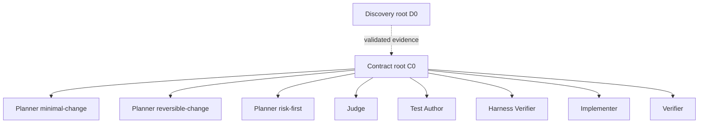

# Architecture

ChangeSafely is an explicit TypeScript orchestration pipeline around one long-lived
Codex App Server process. It avoids a generic workflow engine: each phase is an
async function with a persisted boundary and a schema-validated artifact.

## Context graph



D0 and C0 are separate `thread/start` roots. Every decision or write role is a
`thread/fork` from the immutable completed C0 turn. The Implementer receives the
selected plan as data and cannot inherit Planner discussion. Harness and final Verifiers use fresh
read-only C0 forks. The final Verifier receives the actual diff and deterministic results and cannot
inherit Implementer history. A bounded harness correction resumes only the original Test Author.

## Data flow

1. `workflow.ts` checks the baseline, runs D0 and C0, forks planners, applies pure
   eligibility rules, and asks the Judge to select one eligible plan.
2. `harness.ts` revalidates B0, creates the ChangeSafely branch, forks Test Author, proves and
   commits baseline-green C1, then resumes that thread to add baseline-red T1 when behavior
   changes. It protects the union of both stages. `harness-evidence.ts` rejects incomplete or
   invalid check relationships before either a harness commit or the Implementer fork.
   `coverage.ts` records the C1 impacted-slice baseline using only authorized repository commands
   and otherwise retains the explicit executable coverage matrix. A fresh C0 Verifier then reviews
   the complete protected harness. The same Test Author may append at most two corrections, each
   followed by deterministic gates and a separate commit. Only an accepted aggregate
   `harness-review.json` opens the Implementer boundary.
3. `implementation.ts` forks Implementer, validates actual paths, commits I1, runs
   deterministic checks, compares final scoped coverage with C1, and forks an independent
   Verifier. Final acceptance combines the model verdict with the already validated contract-to-
   check mappings, H1 result, protected hashes, C1/T1/final commands, and coverage comparison; an
   accepted verdict cannot retain findings or residual risks. One local repair may resume the same
   Implementer only for an `IMPLEMENTATION_DEFECT` on a selected production path before a fresh
   Verifier fork and receives a separate final coverage artifact.
4. `orchestrator.ts` validates persisted boundaries and applies the final release
   gate before emitting `VERIFIED`.

```text
task -> evidence -> contract -> plans -> eligibility -> decision
     -> characterization/C1 -> optional change harness/T1
     -> coverage baseline -> harness review/H1 -> implementation/I1
     -> commands + final coverage -> verification -> report
```

## Sources of truth

- Git commit ids, branch, status, paths, and diffs.
- Atomic artifact envelopes and SHA-256 hashes.
- Versioned state and artifact contracts with named predecessor hashes.
- TypeBox contracts used as both inferred TypeScript types and locally compiled JSON Schemas.
- Structured command argv, real exit codes, timeouts, and bounded output.
- Stable executable check IDs mapped to acceptance criteria, protected invariants, critical risks,
  grounded assertion evidence, and explicit non-interference applicability.
- Comparable C1/final impacted-slice coverage artifacts. Numeric line and branch data is accepted
  only through a language-neutral repository marker; otherwise the branch/state/failure matrix is
  preserved without a fabricated percentage.
- Explicit App Server thread ids, turn ids, parent C0 id, and checkpoint turn id.

Model statements are proposals or findings, never sufficient proof of success.
The append-only trace is diagnostic history, not a source of workflow truth and not
an event-sourced state machine.

## CLI boundary

Every completed command is represented by one `RunOutcome`. Human text and the
versioned `--json` document are renderings of that same value, and one status table
defines exit codes. `status` reconstructs the outcome from verified persisted state
without changing Git or artifacts. Expected operational failures use bounded
`ChangeSafelyError` codes; unexpected exceptions are not converted into successful or
blocked workflow results. Outcomes include direct paths to state, report, trace,
manifest, and schema-validated artifacts.

`report.ts` reconstructs the assurance profile from hash-verified artifacts and the privacy-safe
trace. The same pure renderer is used before and after the release gate, so the Markdown report can
be reproduced offline without a model or repository command execution. Every section identifies
its artifact or trace source; no captured command output is copied into the report.

## Runtime boundary

`AppServerClient` is a thin JSONL client, not an SDK. It implements initialization,
request correlation, concurrent responses, thread start/fork/resume, turn completion,
timeouts, interruption, and process failure. TypeScript declarations and JSON Schemas
are generated from the exact development baseline recorded in
`protocol-version.json`. The runtime may differ; handshake and used messages are
validated before their data is trusted.

Repository commands are independent child processes wrapped by the Codex sandbox.
They are allowlisted, non-interactive, network-disabled, and run with a sanitized
environment. Their evidence includes exact argv, repository-relative cwd, timing,
exit/signal/timeout, sandbox state, byte counts, SHA-256 hashes, and truncation flags.
See [`THREAT_MODEL.md`](THREAT_MODEL.md) for the limits of this boundary.

The core does not parse or transform target source code. Ecosystem-specific knowledge
is limited to a baseline repository capability catalog: approved checks, working
directories, test paths, control files, and their source. The current implementation
has bounded npm and pytest detection. Subsequent toolchains must reuse the same process
runner and Git/artifact flow rather than introduce per-language orchestration. A tracked
root `changesafely.config.json` supplies the same exact argv/cwd contract for other and
polyglot repositories. Explicit repository capabilities remain immutable data, not a
runtime plugin system: the config cannot contain shell strings, setup hooks, environment
overrides, or credentials.

## Persistence and recovery

`.changesafely/runs/<run-id>/state.json` records the last completed boundary. Resume is
allowed only after planning, T1, or independent verification. Before reuse,
ChangeSafely checks persisted-format versions before full schema validation, the closed
phase/status contract, named artifact inputs, artifact hashes and schemas, role
lineage, Git branch and HEAD, baseline ancestry, protected configuration metadata,
and T1 hashes. Unknown state or artifact versions fail closed. Current artifacts use format v5;
hash-verified v2-v4 artifacts remain readable through explicit conservative normalization. Missing
contract provenance, harness mappings, or coverage remains unknown or unresolved, so an older run
cannot cross a current write boundary by assuming evidence that it never recorded.

Each run also has `trace.jsonl`, a versioned append-only sequence written through one
serialized `TraceWriter`. It correlates phase and state transitions, role turns,
App Server lifecycle and JSON-RPC method timing, artifact hashes, deterministic
commands, fork lineage, privacy-safe tool metadata, cumulative token snapshots, Git
branch/commit boundaries, interruptions, resumes, and failures. Read-only trace
inspection derives per-turn deltas, cached and non-cached input, output and reasoning
tokens, elapsed/model/command time, corrections, failures, and artifact volume. Missing
lineage or counters remain unavailable rather than being estimated.
`manifest.json` records ChangeSafely, Node, Git, Codex, platform, model, role effort,
sandbox policy, and prompt/output-schema hashes. The trace stores metadata and hashes,
not task text, prompts, model messages, JSON-RPC bodies, repository contents, or raw
command output. Malformed payloads are represented by type, validation paths, byte
count, and SHA-256 only.

`--diagnostics` is an explicit local opt-in that writes bounded command stdout/stderr
and App Server stderr tails under `diagnostics/`. On POSIX, run directories use mode
`0700` and trace, manifest, and diagnostic files use `0600`. The default mode does not
create the diagnostics directory. `changesafely trace --run <run-id> [--json]` reads
the timeline without mutating it. Trace replay is never used for workflow recovery.

Failures keep the branch, working tree, and artifacts inspectable. ChangeSafely does
not claim automatic rollback or clean up user state.

## Extension rule

New abstractions require a current second use case. Python is the second target
toolchain that justifies extracting the npm command policy into a small capability
value model; it does not justify a plugin framework. Providers, worktrees, hosted
services, and UI surfaces remain outside the core until the existing vertical workflow
demonstrates a concrete need.
